# Wireframe Mockups
## Widget 2x4 Mockup

<figure class="image image_resized" style="width:44.84%;">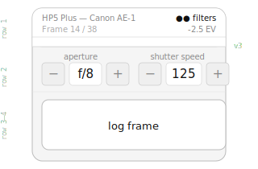</figure>

## Quick Screen

<figure class="image image_resized" style="width:35.29%;">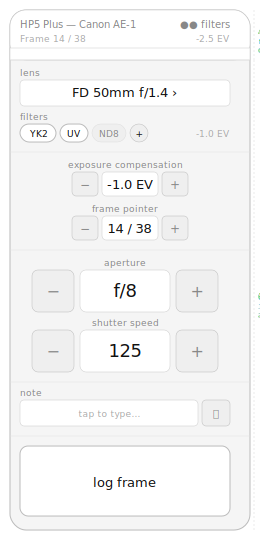</figure>

**Active Roll Switch Screen**

<figure class="image">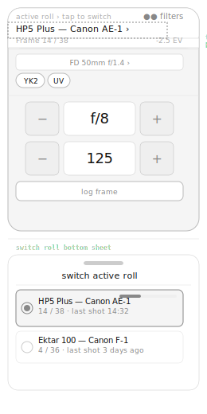</figure>

## Roll List

<figure class="image image_resized" style="width:30.25%;"></figure>

**Roll List v2:**

<figure class="image">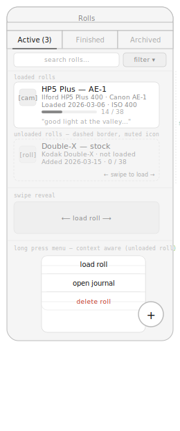</figure>

## Roll Journal

<figure class="image"></figure>

**Roll Journal v2**

<figure class="image">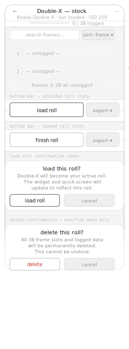</figure>

## Frame Detail

<figure class="image">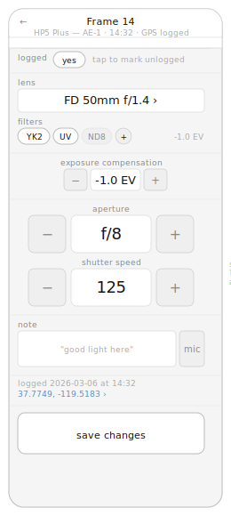</figure>

## Roll Setup

<figure class="image">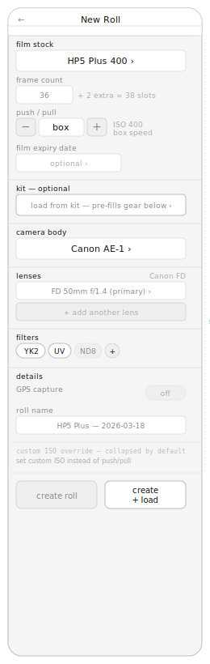</figure>

## Roll Setup> Kit Selector

<figure class="image image_resized" style="width:32.6%;">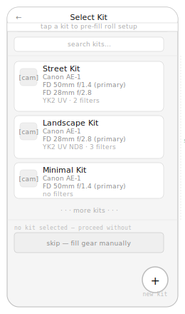</figure>

## Gear Library (All in one mockup)

<figure class="image">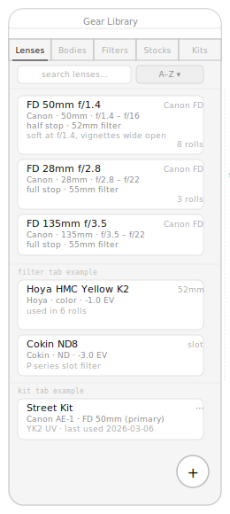</figure>

## Gear Detail

<figure class="image">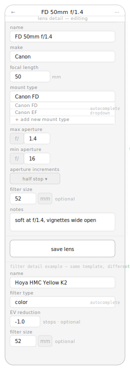</figure>

## Kit Detail screen

<figure class="image">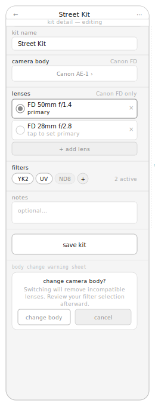</figure>

## Settings Wireframe

<figure class="image">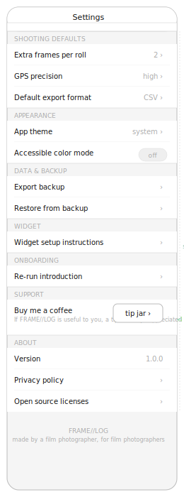</figure>

## Export sheet

<figure class="image">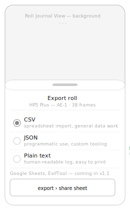</figure>

## Onboarding Coach screens

<figure class="image">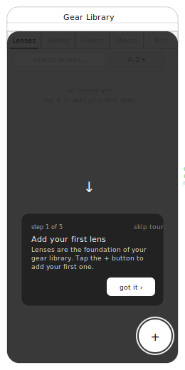</figure>

## Welcome Screen & Widget Setup screen

<figure class="image">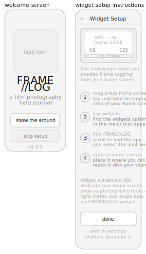</figure>